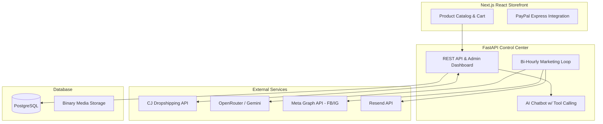

# Lumively: Autonomous AI-Powered E-Commerce & Marketing Engine

> **A full-stack, AI-driven e-commerce platform engineered to autonomously handle supply chain fulfillment, generate marketing content, and execute cross-platform social media distribution.**

[](https://www.python.org/)
[](https://fastapi.tiangolo.com/)
[](https://nextjs.org/)
[](https://www.postgresql.org/)

---

## 🚀 Technical Highlights & Achievements

- **Autonomous Supply Chain**: Integrated CJ Dropshipping API v2 to engineer a zero-touch fulfillment system, featuring a dynamic pricing engine and automated bulk-product imports using regex extraction.
- **AI Tool Calling Agent**: Architected an NLP-driven admin assistant using OpenRouter and Gemini-2.5-Flash. The agent features function-calling capabilities to trigger backend operations, query the database, and execute marketing campaigns via natural language.
- **Event-Driven Marketing Loop**: Developed a background worker using `APScheduler` that runs a bi-hourly cycle to sequentially rotate products, generate premium LLM-written copy, and publish to Facebook and Instagram via the Meta Graph API.
- **Robust Media Pipeline**: Implemented asynchronous polling for Instagram's video container processing and designed a custom database-backed media server capable of streaming raw video bytes directly to Meta APIs, bypassing ephemeral filesystem limitations.
- **Full-Stack Architecture**: Built a high-performance backend using FastAPI and Python, paired with a Next.js/React storefront. Unified data access across both environments using Prisma ORM with PostgreSQL.

---

## 🏗 Architecture Overview



---

## 💻 Core Features

### 1. Zero-Touch Dropshipping & Supply Chain
- **Bulk SPU Importer**: Parses raw text for CJ SPU codes, automatically fetching product details, images, and inventory.
- **Dynamic Pricing Engine**: Programmatically sets retail and strikethrough pricing based on real-time wholesale costs.
- **Automated Fulfillment**: Leverages CJ's `createOrderV2` endpoint with automated wallet deduction, eliminating manual order processing.

### 2. Generative AI Intelligence
- **Marketing Asset Generation**: Transforms raw product metadata into high-converting Instagram captions, email subjects, and HTML email bodies in a single inference call.
- **Admin Chatbot**: Allows store owners to type *"Import product CJ123 and run a marketing campaign"*—the bot translates this intent into sequential API calls and executes them securely.

### 3. Cross-Platform Social Media Automation
- **Video-First Logic**: Automatically detects media types and prioritizes Instagram Reels when video data is present, falling back to Facebook Carousels for multi-image products.
- **Async Processing**: Implements `asyncio.sleep` polling mechanisms to handle Instagram's containerized video publishing workflow.
- **Database Media Streaming**: Stores large video assets directly in PostgreSQL as binary (`Bytes`) and serves them via a dedicated streaming endpoint to survive ephemeral cloud restarts.

---

## 🛠 Tech Stack

- **Backend Framework**: Python, FastAPI, Uvicorn, Gunicorn
- **Frontend / UI**: HTML5, TailwindCSS, Vue.js (Dashboard), Next.js (Storefront)
- **Database / ORM**: PostgreSQL, Prisma (Python & Node.js clients)
- **Automation / Tasks**: APScheduler, Asyncio
- **Integrations**: CJ Dropshipping API, Meta Graph API, Resend, OpenRouter, PayPal SDK
- **DevOps**: Render (Web Service + DB), Docker, GitHub Actions

---

## ⚙️ Local Development Setup

### Prerequisites
- Python 3.11+
- Node.js 18+ (for Prisma CLI)
- PostgreSQL database

### Installation

1. **Clone and setup environment**:
   ```bash
   cd python_admin
   cp .env.example .env
   # Add your DB credentials and API keys
   ```

2. **Install dependencies**:
   ```bash
   pip install -r requirements.txt
   ```

3. **Generate ORM and Push Schema**:
   ```bash
   npx prisma generate --schema=schema_py.prisma
   npx prisma db push --schema=schema_py.prisma
   ```

4. **Start the API & Dashboard**:
   ```bash
   uvicorn main:app --reload --port 8000
   ```
   *Dashboard available at `http://localhost:8000/admin`*

---

## 📂 System Architecture & Project Structure

```text
python_admin/
├── main.py                    # FastAPI application & lifecycle events
├── config.py                  # Pydantic environment validation
├── schema_py.prisma           # Prisma DB Schema (Python)
├── routers/
│   ├── admin.py               # Admin Dashboard UI Controller
│   ├── api.py                 # Core REST API & Binary Media Server
│   └── marketing.py           # Campaign Management & Manual Overrides
├── services/
│   ├── ai_service.py          # LLM integrations & prompt engineering
│   ├── chat_agent.py          # NLP Tool-Calling Router
│   ├── cj_service.py          # Dropshipping Supply Chain Client
│   ├── email_service.py       # Resend Transactional Email Client
│   ├── scheduler.py           # Background APScheduler Job Queue
│   └── social_service.py      # Async Meta Graph API orchestrator
└── templates/                 # Vue.js + Tailwind HTML Views
```

---

## 🔒 Security & Performance
- **Authentication**: JWT cookie-based session management with secure Bearer token API fallbacks.
- **Monitoring**: Integrated `/health` endpoints and Prometheus `/metrics` for real-time observability.
- **Resource Management**: File-based access token caching with automated refresh cycles to minimize outbound authentication requests.

---
*Built as a scalable, modern e-commerce infrastructure showcasing advanced API orchestration, generative AI integration, and autonomous background processing.*